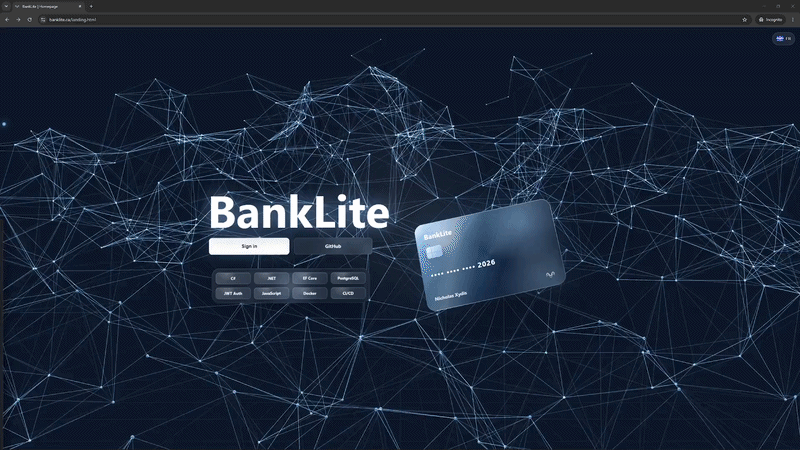
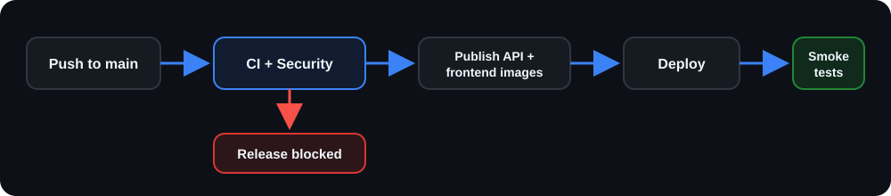
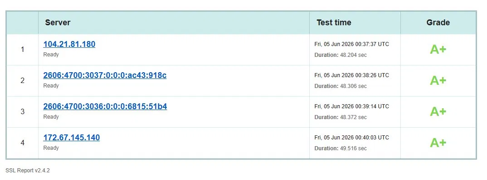
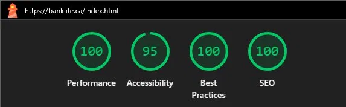
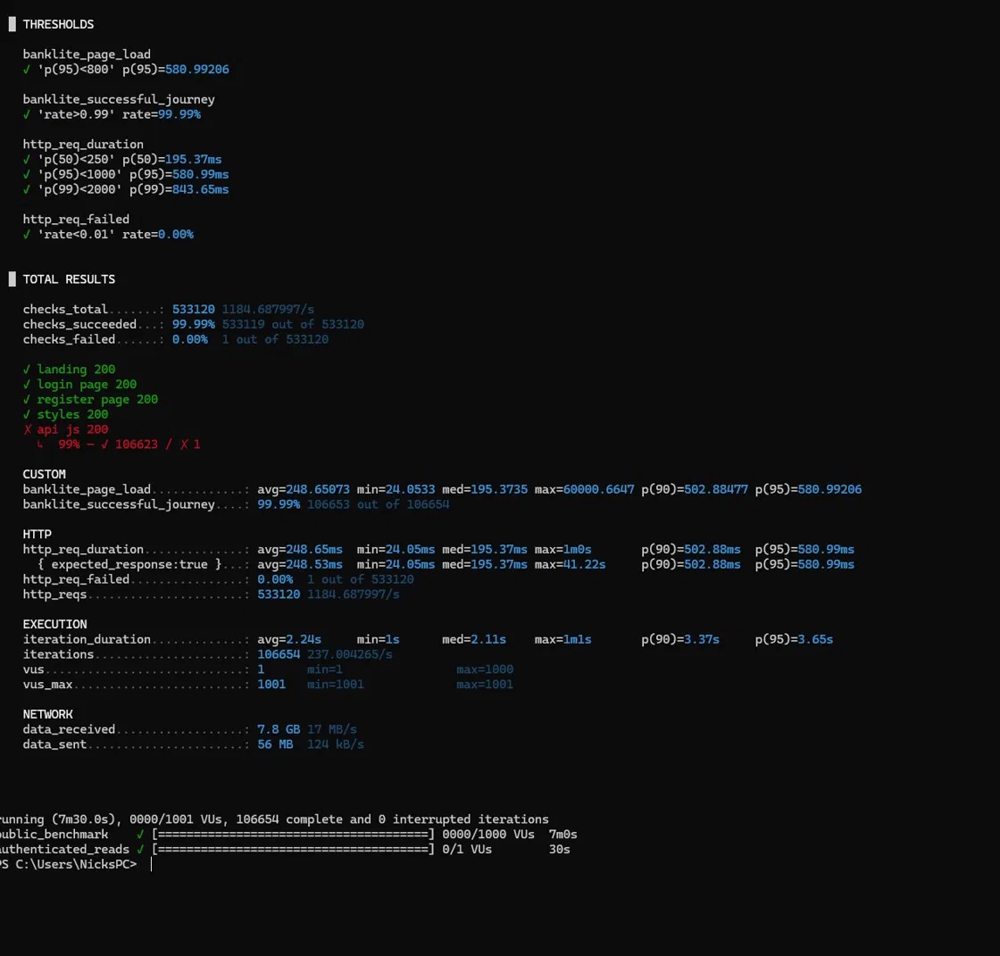
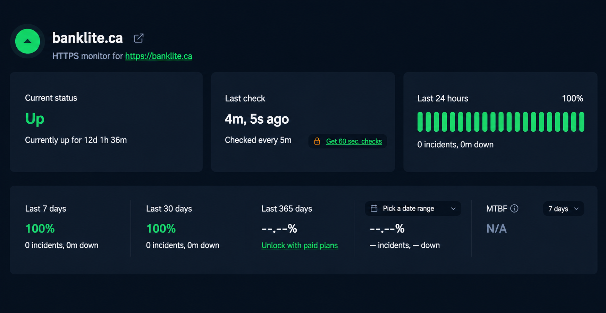

<div align="center">

# BankLite

[](https://git.io/typing-svg)

A secure, production-deployed banking application built to showcase real-world full-stack engineering.

<br>

<br>

<p align="center">
  
  &nbsp;&nbsp;
  
  &nbsp;&nbsp;
  
  &nbsp;&nbsp;
  
  &nbsp;&nbsp;
  
</p>

<p align="center">
  
  &nbsp;&nbsp;
  
  &nbsp;&nbsp;
  
  &nbsp;&nbsp;
  
</p>

<p align="center">
  <strong>460 automated tests</strong> &nbsp;|&nbsp; <strong>1,184 req/s k6 benchmark</strong> &nbsp;|&nbsp; <strong>CodeQL + Trivy security scans</strong> &nbsp;|&nbsp; <strong>Linux VPS deployed</strong>
</p>

<a href="https://banklite.ca">
  
</a>

</div>

<br>

<div align="center">

</div>

## About

BankLite is a secure banking application with account creation, deposits, withdrawals, transfers, transaction history, real-time balance updates, and an AI banking assistant. The backend follows Clean Architecture across Domain, Application, Infrastructure, and API layers. The production stack runs on a Linux VPS with Docker, PostgreSQL, Nginx, GitHub Actions, GHCR image publishing, SSH-based deployment, and Cloudflare in front of the application. All money is virtual.

## Security Highlights

- BCrypt password hashing.
- JWT authentication delivered through HttpOnly Secure cookies.
- Refresh token rotation with SHA256 token hashing.
- CSRF origin/referer validation on unsafe API methods.
- CSP, HSTS, X-Frame-Options, no-store caching, and hardened response headers.
- Account lockout after 5 failed login attempts.
- Partitioned rate limiting for global, auth, refresh, chat, and password flows.
- Idempotency-key support on deposit, withdrawal, internal transfer, and external transfer endpoints.
- Serializable database transactions and PostgreSQL `xmin` optimistic concurrency.
- Cloudflare-fronted production deployment.

## Features

**Auth:** registration, login, logout, refresh tokens, forgot/reset password, change password, account deletion.<br>
**Banking:** chequing/savings accounts, deposit, withdrawal, internal transfer, external transfer by account number.<br>
**Transactions:** pagination, type filters, date-grouped history, CSV export.<br>
**Realtime:** SignalR balance updates.<br>
**AI:** Alfred, a Groq-powered BankLite assistant.<br>
**UI:** English/French language toggle, dark/light mode, responsive mobile experience.

## Architecture

```text
BankLite/
├─ frontend/                    Static banking UI served by Nginx
│  ├─ css/                      Shared styles, landing page styles, themes, responsive layout
│  ├─ js/                       API client, auth/session, i18n, and banking page controllers
│  ├─ tests/                    Playwright E2E suite and test configuration
│  ├─ landing.html              Public marketing/entry page
│  ├─ index.html                Login page
│  ├─ register.html             Registration page
│  ├─ dashboard.html            Account overview, balances, cards, and Alfred chat entry
│  ├─ deposit.html              Deposit workflow
│  ├─ withdraw.html             Withdrawal workflow
│  ├─ transfer.html             Internal and external transfer workflow
│  ├─ transactions.html         Transaction history, filters, and CSV export
│  ├─ reset-password.html       Password reset flow
│  ├─ privacy.html / terms.html Legal pages
│  ├─ nginx*.conf               Frontend Nginx server configuration
│  └─ Dockerfile                Production frontend image
├─ backend/
│  ├─ BankLite.Domain/          Entities and repository contracts
│  ├─ BankLite.Application/     DTOs, validators, service interfaces, business rules
│  ├─ BankLite.Infrastructure/  EF Core, repositories, PostgreSQL, JWT, email, AI providers
│  ├─ BankLiteAPI/BankLite.API/ Controllers, middleware, SignalR hubs, auth, API composition
│  └─ BankLite.Tests/           xUnit unit and integration tests
├─ docker/                      Container support scripts, including PostgreSQL initialization
├─ docs/                        Demo media, screenshots, OpenAPI export, load-test evidence
├─ load-tests/                  k6 load benchmark scripts
├─ postman/                     Local and production Postman collections/environments
├─ docker-compose.yml           Production-style local compose stack
├─ docker-compose.e2e.yml       Playwright E2E compose stack
└─ .github/workflows/           CI, security scanning, image publishing, SSH production deploy
```

<div align="center">
<pre>
┌────────────────────────────────────────────────────────────┐
│                      Customer Browser                      │
│          Banking UI, auth flows, real-time updates         │
└──────────────────────────────┬─────────────────────────────┘
                               │ HTTPS + SignalR
┌──────────────────────────────▼─────────────────────────────┐
│                    Cloudflare Edge Network                 │
│              TLS, DNS, proxying, edge protection           │
└──────────────────────────────┬─────────────────────────────┘
                               │ Origin traffic
┌──────────────────────────────▼─────────────────────────────┐
│                         Linux VPS                          │
│                  Docker Compose production host            │
└──────────────────────────────┬─────────────────────────────┘
                               │ Container routing
┌──────────────────────────────▼─────────────────────────────┐
│                    Frontend Nginx Container                │
│        Static UI, security headers, API + realtime proxy   │
└──────────────────────────────┬─────────────────────────────┘
                               │ Proxied app traffic
┌──────────────────────────────▼─────────────────────────────┐
│                    ASP.NET API Container                   │
│       Controllers, middleware, cookies, auth, rate limits  │
└──────────────────────────────┬─────────────────────────────┘
                               │ DTOs + use cases
┌──────────────────────────────▼─────────────────────────────┐
│                        Application                         │
│       Services, validators, interfaces, business rules     │
└──────────────────────────────┬─────────────────────────────┘
                               │ Domain contracts
┌──────────────────────────────▼─────────────────────────────┐
│                           Domain                           │
│              Entities, invariants, repository contracts    │
└──────────────────────────────▲─────────────────────────────┘
                               │ Implementations
┌──────────────────────────────┴─────────────────────────────┐
│                       Infrastructure                       │
│          EF Core, repositories, JWT, SendGrid, Groq        │
└───────────────┬──────────────────────────────┬─────────────┘
                │                              │
┌───────────────▼──────────────┐   ┌───────────▼─────────────┐
│     PostgreSQL Container     │   │     External Providers  │
│   Accounts, users, tokens,   │   │   SendGrid email, Groq  │
│   transactions, audit logs   │   │   AI assistant responses│
└──────────────────────────────┘   └─────────────────────────┘
</pre>
</div>

- **Domain:** core entities and contracts with no infrastructure dependency.
- **Application:** use-case services, DTOs, validation, and business exceptions.
- **Infrastructure:** EF Core repositories, unit of work, email, JWT, Groq, and persistence.
- **API:** HTTP endpoints, authentication, rate limits, middleware, SignalR, and composition root.

## Tech Stack

| Area         | Stack                                                           |
| ------------ | --------------------------------------------------------------- |
| Backend      | ASP.NET Core 8, C#, EF Core, FluentValidation, Serilog, SignalR |
| Frontend     | HTML, CSS, JavaScript                                           |
| Database     | PostgreSQL 16                                                   |
| DevOps       | Docker, GitHub Actions, Nginx, Cloudflare, Linux VPS            |
| Testing      | xUnit, Moq, Bogus, Playwright, TypeScript, k6                   |
| Integrations | SendGrid password reset email, Groq AI chat                     |
| Monitoring   | UptimeRobot                                                     |

## Testing

| Suite                    | Count | Tools                      |
| ------------------------ | ----: | -------------------------- |
| Backend unit/integration |   438 | xUnit, Moq, Bogus, Respawn |
| End-to-end               |    22 | Playwright                 |
| Total                    |   460 | CI-backed test coverage    |

## CI/CD

| Workflow          | File                                      | Purpose                                            |
| ----------------- | ----------------------------------------- | -------------------------------------------------- |
| CI                | `.github/workflows/ci.yml`                | Compose validation, backend tests, Playwright E2E  |
| Security          | `.github/workflows/security.yml`          | CodeQL and Trivy filesystem/image scans            |
| Publish Images    | `.github/workflows/publish-images.yml`    | Build, scan, and push GHCR images                  |
| Deploy Production | `.github/workflows/deploy-production.yml` | SSH deploy to Linux VPS and production smoke tests |

<div align="center">
  
</div>

Any required gate failure blocks the release.

## Production Engineering

- API and frontend containers run as non-root users with read-only filesystems.
- PostgreSQL, API, and frontend services use container health checks.
- Production images are pinned and published by commit SHA for traceable deployments.
- Deployment records capture the deployed SHA, image tags, and UTC release timestamp.
- Public health and application smoke tests run after every production deployment.
- UptimeRobot checks production availability every five minutes.

## API Docs

- Swagger UI: run locally with `ASPNETCORE_ENVIRONMENT=Development`
- OpenAPI export: [docs/openapi.json](docs/openapi.json)
- Postman collection: [postman/BankLite.postman_collection.json](postman/BankLite.postman_collection.json)
- Postman environments: [postman/BankLite_Local.postman_environment.json](postman/BankLite_Local.postman_environment.json), [postman/BankLite_Production.postman_environment.json](postman/BankLite_Production.postman_environment.json)

## Quality Gates

### SSL Labs

<div align="center">
  
</div>

**TLS configuration:** A+ across the assessed Cloudflare edge endpoints.

### Lighthouse

<div align="center">
  
</div>

**Production audit:** Lighthouse validates performance, accessibility, best practices, and SEO.

### k6 Load Benchmark

<div align="center">
  
</div>

**k6 load benchmark:** 1,000 VUs, 533,120 requests, 1,184 req/s, p95 581ms, p99 844ms, 0.00% request failure rate. See [docs/load-test.md](docs/load-test.md).

### Uptime Monitoring

<div align="center">
  
</div>

**External monitoring:** UptimeRobot checks BankLite every five minutes. Container health checks, deployment smoke tests, and the public `/health` endpoint provide additional runtime verification.

<details>
<summary><strong>Getting Started</strong></summary>

### Prerequisites

- .NET 8 SDK
- Docker Desktop
- Node.js 22 for Playwright tests
- k6 for load testing

### Clone

```powershell
git clone https://github.com/NicholasXydis/BankLite.git
cd BankLite
```

### Configure

```powershell
Copy-Item .env.example .env
```

Fill `.env` with local secrets. Keep `.env` ignored and never commit it.

For local non-Docker API work, use `appsettings.Development.json` or .NET user secrets for development-only credentials.

### Docker

Docker Compose starts PostgreSQL, runs EF Core migrations, and serves the API and static frontend using the values from `.env`.

```powershell
docker compose --profile tools run --rm migrate
docker compose up --build
```

Frontend available at:

```
http://127.0.0.1:8080
```

### Backend Tests

Backend integration tests require a local PostgreSQL test database or an overridden `ConnectionStrings__DefaultConnection`.

```powershell
dotnet test backend/BankLite.Tests/BankLite.Tests.csproj
```

### Playwright E2E

```powershell
cd frontend/tests
npm ci
npm test
```

### k6 Benchmark

```powershell
k6 run load-tests/banklite-benchmark.js
```

</details>

<details>
<summary><strong>Environment Variables</strong></summary>

| Variable                         | Description                                                          |
| -------------------------------- | -------------------------------------------------------------------- |
| `POSTGRES_DB`                    | PostgreSQL database name.                                            |
| `POSTGRES_ADMIN_USER`            | PostgreSQL admin/migration user.                                     |
| `POSTGRES_ADMIN_PASSWORD`        | PostgreSQL admin/migration password.                                 |
| `POSTGRES_APP_USER`              | Least-privilege application database user.                           |
| `POSTGRES_APP_PASSWORD`          | Application database password.                                       |
| `DB_CONNECTION_STRING`           | Runtime API connection string for the application user.              |
| `DB_MIGRATION_CONNECTION_STRING` | Migration connection string for the admin user.                      |
| `ASPNETCORE_ENVIRONMENT`         | ASP.NET Core environment.                                            |
| `JWT_SECRET`                     | Cryptographically random JWT signing secret, at least 32 characters. |
| `JWT_ISSUER`                     | JWT issuer.                                                          |
| `JWT_AUDIENCE`                   | JWT audience.                                                        |
| `SENDGRID_API_KEY`               | SendGrid API key for password reset email.                           |
| `SENDGRID_FROM_EMAIL`            | From email address for outbound reset email.                         |
| `SENDGRID_FROM_NAME`             | From display name for outbound reset email.                          |
| `GROQ_API_KEY`                   | Groq API key for Alfred chat.                                        |
| `FRONTEND_URL`                   | Allowed frontend origin.                                             |
| `RESET_PASSWORD_URL`             | Password reset page URL used in reset emails.                        |

</details>

## License

BankLite is released under the [MIT License](LICENSE).
