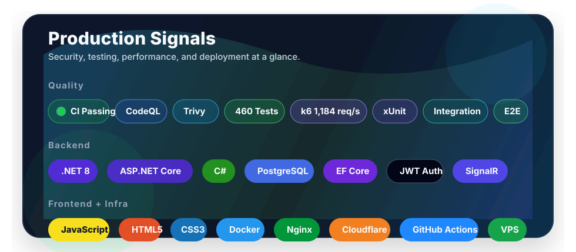
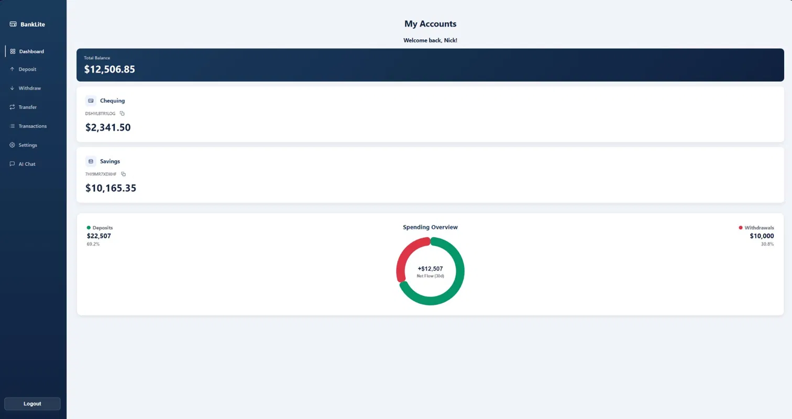
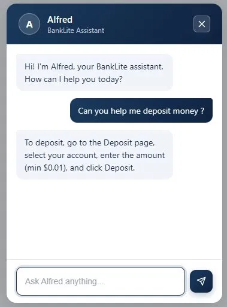
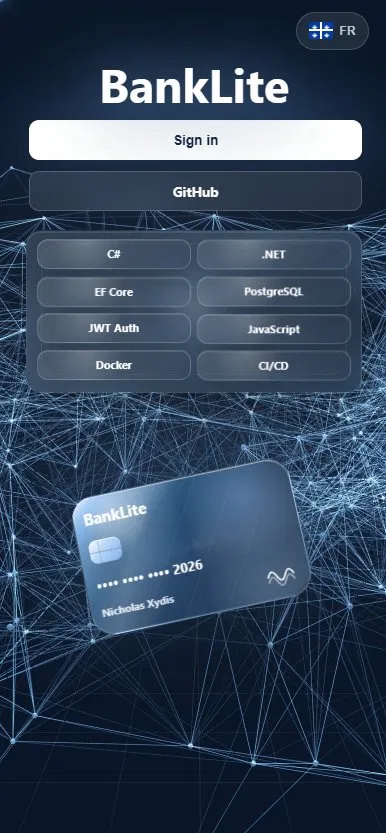
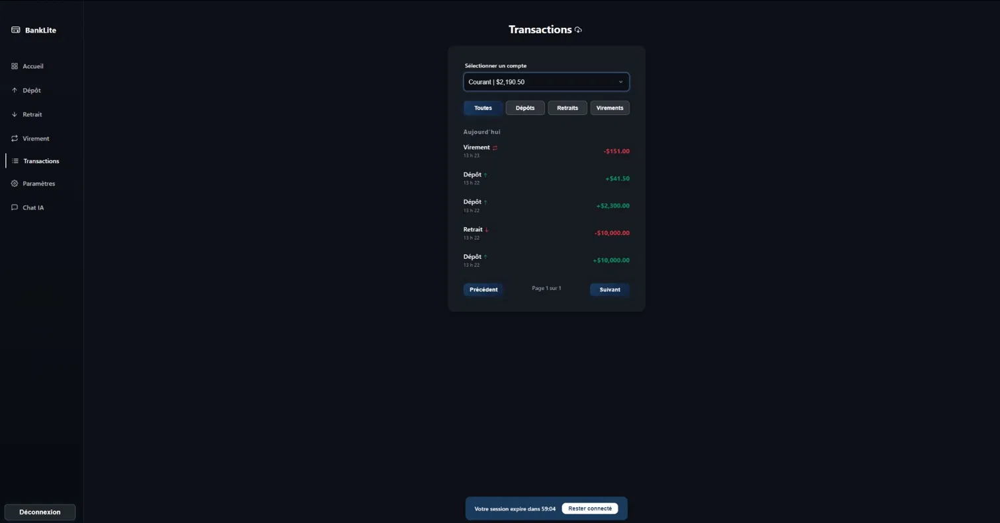

<div align="center">

# BankLite

[](https://git.io/typing-svg)

A secure, production-deployed banking site built to showcase real-world full-stack engineering.

<br>



<br>

<h2 align="center">Live Production Demo</h2>

<a href="https://banklite.ca">
  
</a>

<br>


</div>

## Screenshots

| Dashboard | Alfred Chat |
|---|---|
|  |  |

| Mobile Landing | Dark/French Transactions |
|---|---|
|  |  |

## About

BankLite is a secure banking simulation with account creation, deposits, withdrawals, transfers, transaction history, real-time balance updates, and an AI banking assistant. The backend follows Clean Architecture across Domain, Application, Infrastructure, and API layers. The production stack runs in Docker with PostgreSQL, GitHub Actions, GHCR image publishing, VPS deployment, and Cloudflare in front of the application. All money is virtual.

## Security Highlights

- BCrypt password hashing.
- JWT authentication delivered through HttpOnly Secure cookies.
- Refresh token rotation with SHA256 token hashing.
- CSRF origin/referer validation on unsafe API methods.
- CSP, HSTS, X-Frame-Options, no-store caching, and hardened response headers.
- Account lockout after 5 failed login attempts.
- Partitioned rate limiting for global, auth, refresh, chat, and password flows.
- Idempotency-key support on deposit, withdrawal, internal transfer, and external transfer endpoints.
- Serializable database transactions and PostgreSQL `xmin` optimistic concurrency.
- Cloudflare-fronted production deployment with authenticated origin access.

## Features

**Auth:** registration, login, logout, refresh tokens, forgot/reset password, change password, account deletion.<br>
**Banking:** chequing/savings accounts, deposit, withdrawal, internal transfer, external transfer by account number.<br>
**Transactions:** pagination, type filters, date ranges, CSV export.<br>
**Realtime:** SignalR balance updates.<br>
**AI:** Alfred, a Groq-powered BankLite assistant.<br>
**UI:** English/French language toggle, dark/light mode, responsive mobile experience.

## Architecture

```text
BankLite/
├─ frontend/                    Static HTML/CSS/JS app served by Nginx
├─ backend/
│  ├─ BankLite.Domain/          Entities and repository contracts
│  ├─ BankLite.Application/     DTOs, validators, service interfaces, business rules
│  ├─ BankLite.Infrastructure/  EF Core, repositories, token/email/AI integrations
│  ├─ BankLiteAPI/BankLite.API/ Controllers, middleware, SignalR, API composition
│  └─ BankLite.Tests/           Unit and integration tests
├─ postman/                     Local and production Postman collections
├─ docs/                        OpenAPI export, screenshots, benchmark evidence
└─ docker-compose.yml           Production-style local compose stack
```

```text
┌──────────────────────────────────────────────┐
│ API                                          │
│ Controllers, middleware, SignalR, auth setup │
└───────────────────────┬──────────────────────┘
                        │
┌───────────────────────▼──────────────────────┐
│ Application                                  │
│ Services, DTOs, validators, business rules   │
└───────────────────────┬──────────────────────┘
                        │
┌───────────────────────▼──────────────────────┐
│ Domain                                       │
│ Entities and repository contracts            │
└───────────────────────▲──────────────────────┘
                        │
┌───────────────────────┴──────────────────────┐
│ Infrastructure                               │
│ EF Core, PostgreSQL, repositories, providers │
└──────────────────────────────────────────────┘
```

- **Domain:** core entities and contracts with no infrastructure dependency.
- **Application:** use-case services, DTOs, validation, and business exceptions.
- **Infrastructure:** EF Core repositories, unit of work, email, JWT, Groq, and persistence.
- **API:** HTTP endpoints, authentication, rate limits, middleware, SignalR, and composition root.

## Tech Stack

| Area | Stack |
|---|---|
| Backend | ASP.NET Core 8, C#, EF Core, FluentValidation, Serilog, SignalR |
| Frontend | HTML, CSS, JavaScript, Chart.js, Nginx |
| Database | PostgreSQL 16, EF Core migrations, Respawn test resets |
| DevOps | Docker, Docker Compose, GitHub Actions, GHCR, Cloudflare, VPS |
| Testing | xUnit, Moq, Bogus, Respawn, Playwright, k6 |
| Integrations | SendGrid password reset email, Groq AI chat |

<div align="center">


</div>

## Testing

| Suite | Count | Tools |
|---|---:|---|
| Backend unit/integration | 438 | xUnit, Moq, Bogus, Respawn |
| End-to-end | 22 | Playwright |
| Total | 460 | CI-backed test coverage |

## CI/CD

| Workflow | File | Purpose |
|---|---|---|
| CI | `.github/workflows/ci.yml` | Compose validation, backend tests, Playwright E2E |
| Security | `.github/workflows/security.yml` | CodeQL and Trivy filesystem/image scans |
| Publish Images | `.github/workflows/publish-images.yml` | Build, scan, and push GHCR images |
| Deploy Production | `.github/workflows/deploy-production.yml` | SSH deploy and production smoke tests |

## API Docs

- Swagger UI: available from the API when enabled
- OpenAPI export: docs/openapi.json
- Postman collection: postman/BankLite.postman_collection.json
- Postman environments: postman/BankLite_Local.postman_environment.json, postman/BankLite_Production.postman_environment.json

## Quality Gates

| SSL Labs | Lighthouse | k6 Public Web Benchmark |
|---|---|---|
|  |  |  |

**k6 public web benchmark:** 1,000 VUs, 533,120 requests, 1,184 req/s, p95 581ms, p99 844ms, 0.00% request failure rate. See [docs/load-test.md](docs/load-test.md).

<details>
<summary><strong>Getting Started</strong></summary>

### Prerequisites

- .NET 8 SDK
- Docker Desktop
- Node.js 22 for Playwright tests
- k6 for load testing

### Clone

```powershell
git clone https://github.com/NicholasXydis/BankLite.git
cd BankLite
```

### Configure

```powershell
Copy-Item .env.example .env
```

Fill `.env` with local secrets. Keep `.env` ignored and never commit it.

For local non-Docker API work, use `appsettings.Development.json` or .NET user secrets for development-only credentials.

### Docker

```powershell
docker compose --profile tools run --rm migrate
docker compose up --build
```

Frontend:

```text
http://127.0.0.1:8080
```

### Backend Tests

```powershell
dotnet test backend/BankLite.Tests/BankLite.Tests.csproj
```

### Playwright E2E

```powershell
cd frontend/tests
npm ci
npm test
```

### k6 Benchmark

```powershell
k6 run load-tests/banklite-benchmark.js
```

</details>

<details>
<summary><strong>Environment Variables</strong></summary>

| Variable | Description |
|---|---|
| `POSTGRES_DB` | PostgreSQL database name. |
| `POSTGRES_ADMIN_USER` | PostgreSQL admin/migration user. |
| `POSTGRES_ADMIN_PASSWORD` | PostgreSQL admin/migration password. |
| `POSTGRES_APP_USER` | Least-privilege application database user. |
| `POSTGRES_APP_PASSWORD` | Application database password. |
| `DB_CONNECTION_STRING` | Runtime API connection string for the application user. |
| `DB_MIGRATION_CONNECTION_STRING` | Migration connection string for the admin user. |
| `ASPNETCORE_ENVIRONMENT` | ASP.NET Core environment. |
| `JWT_SECRET` | Cryptographically random JWT signing secret, at least 32 characters. |
| `JWT_ISSUER` | JWT issuer. |
| `JWT_AUDIENCE` | JWT audience. |
| `SENDGRID_API_KEY` | SendGrid API key for password reset email. |
| `SENDGRID_FROM_EMAIL` | From email address for outbound reset email. |
| `SENDGRID_FROM_NAME` | From display name for outbound reset email. |
| `GROQ_API_KEY` | Groq API key for Alfred chat. |
| `FRONTEND_URL` | Allowed frontend origin. |
| `RESET_PASSWORD_URL` | Password reset page URL used in reset emails. |

</details>

## License

BankLite is released under the [MIT License](LICENSE).
